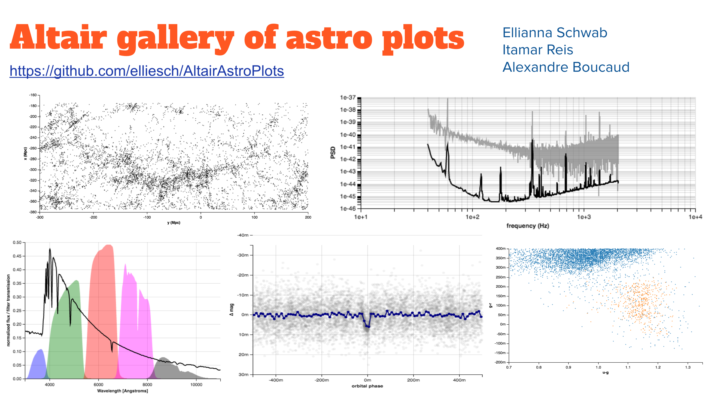

# Altair plot hack

## Context

Hack at [AstroHackWeek2017][ahw17] about reproducing existing astronomical
figures with the declarative visualization library called [Altair][altair].

[ahw17]: https://github.com/AstroHackWeek/AstroHackWeek2017/wiki
[altair]: https://altair-viz.github.io/

## Notebooks

* [HATS-7b](notebooks/HATS-7b.ipynb)
* [SDSS Great Wall](notebooks/SDSS_great_wall.ipynb)
* [RR-Lyrae Magnitudes](notebooks/RR-Lyrae_magnitudes.ipynb)
* [SDSS filters](notebooks/SDSS_filters.ipynb)
* [LIGO power spectrum](notebooks/LIGO_power_spectrum.ipynb)

## Contributors

* Ellianna Schwab @elliesch
* Itamar Reis @ireis
* Alexandre Boucaud @aboucaud

with help and original idea from Jake VanderPlas @jakevdp
